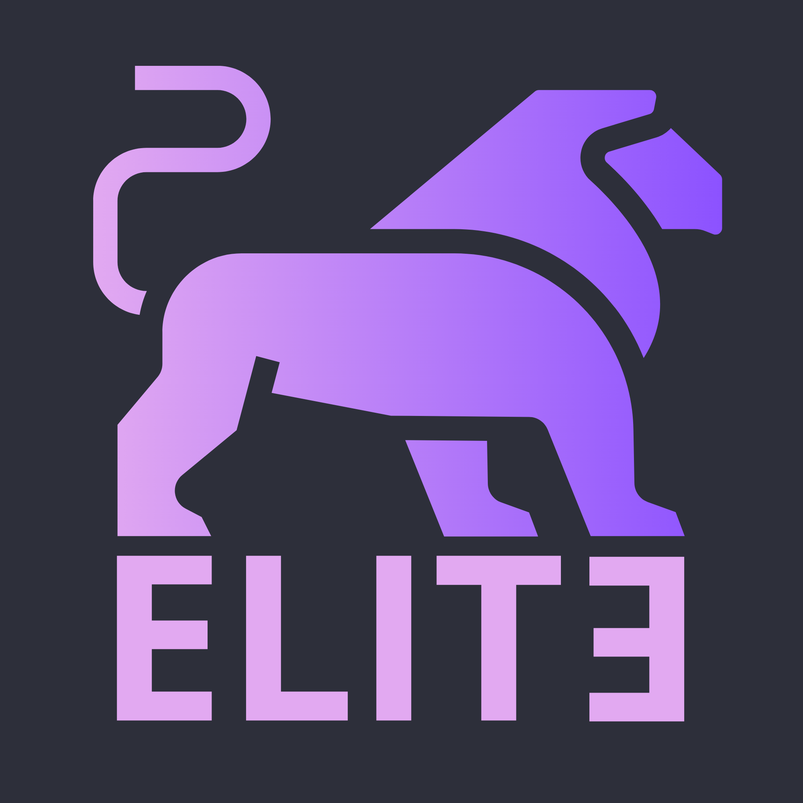

# 🛡️ Sözleşme Özetleyici — Chrome Eklentisi

> Yapay zeka destekli gizlilik sözleşmesi ve kullanım koşulları analiz aracı.

Herhangi bir web sayfasındaki gizlilik politikası veya kullanım sözleşmesini tek tıkla özetleyin, risk skorunu görün ve sözleşme hakkında yapay zekaya sorular sorun.

---

## 📋 İçindekiler

- [Özellikler](#-özellikler)
- [Mimari](#-mimari)
- [Proje Yapısı](#-proje-yapısı)
- [Kurulum](#-kurulum)
- [Kullanım](#-kullanım)
- [API Endpoint'leri](#-api-endpointleri)
- [Teknolojiler](#-teknolojiler)
- [Ekip](#-ekip)

---

## ✨ Özellikler

| Özellik | Açıklama |
|---|---|
| 📄 **Otomatik Metin Çıkarma** | Ziyaret edilen sayfadan sözleşme metnini otomatik olarak ayıklar |
| 🤖 **AI Özetleme** | Gemini 2.5 Flash ile sözleşmeyi kısa ve anlaşılır şekilde özetler |
| 🎯 **Risk Skoru** | 1–10 arası risk puanı ve renk kodlu (kırmızı/sarı/yeşil) madde analizi |
| ⚠️ **Kritik Madde Uyarısı** | Kullanıcının mutlaka bilmesi gereken en kritik maddeyi öne çıkarır |
| 💬 **Sözleşme Sohbet** | Sözleşme hakkında doğal dilde sorular sorup yanıt alabilirsiniz |
| 💾 **Önbellek** | Daha önce özetlenen metinler veritabanında saklanır, tekrar API çağrısı yapılmaz |
| 🌐 **Çok Dilli** | Sözleşmenin dilini otomatik algılar ve aynı dilde yanıt verir |
| 📋 **Kopyalama** | Özet sonucunu tek tıkla panoya kopyalayabilirsiniz |

---

## 🏗️ Mimari

```
┌─────────────────────┐        HTTP        ┌──────────────────────┐
│  Chrome Extension    │  ◄──────────────►  │   FastAPI Backend    │
│  (Manifest V3)       │   localhost:8000   │                      │
│                      │                    │  ┌────────────────┐  │
│  ┌────────────────┐  │                    │  │  summarize.py  │  │
│  │  content.js    │──┼── metin çıkar ──►  │  │  (Gemini API)  │  │
│  │  (DOM scraper) │  │                    │  └────────────────┘  │
│  └────────────────┘  │                    │                      │
│  ┌────────────────┐  │                    │  ┌────────────────┐  │
│  │  popup.js      │──┼── /summarize ───►  │  │   chat.py      │  │
│  │  (UI mantığı)  │  │   /chat      ───►  │  │  (Gemini API)  │  │
│  └────────────────┘  │                    │  └────────────────┘  │
│  ┌────────────────┐  │                    │                      │
│  │ background.js  │  │                    │  ┌────────────────┐  │
│  │ (servis worker)│  │                    │  │   SQLite DB    │  │
│  └────────────────┘  │                    │  │  (links.db)    │  │
└─────────────────────┘                    │  └────────────────┘  │
                                           └──────────────────────┘
```

---

## 📁 Proje Yapısı

```
sozlesme/
├── backend/
│   ├── main.py              # FastAPI uygulama, route'lar ve veritabanı
│   ├── summarize.py         # Gemini ile sözleşme özetleme modülü
│   ├── chat.py              # Gemini ile sözleşme sohbet modülü
│   ├── config.py            # API anahtarı yönetimi
│   ├── requirements.txt     # Python bağımlılıkları
│   ├── Dockerfile           # Docker yapılandırması
│   └── .env.example         # Örnek ortam değişkenleri dosyası
│
├── extension/
│   ├── manifest.json        # Chrome Extension Manifest V3
│   ├── scripts/
│   │   ├── content.js       # Sayfadan metin çıkarma (DOM scraper)
│   │   └── background.js    # Service worker, mesaj yönetimi
│   └── assets/
│       └── popup/
│           ├── popup.html   # Eklenti popup arayüzü
│           ├── popup.css    # Popup stilleri
│           └── popup.js     # Popup uygulama mantığı
│
├── .gitignore
├── docker.compose.yml
└── README.md
```

---

## 🚀 Kurulum

### Gereksinimler

- **Python 3.10+**
- **Google Chrome** tarayıcı
- **Gemini API Anahtarı** — [Google AI Studio](https://aistudio.google.com/app/apikey) üzerinden alınabilir

### 1. Backend Kurulumu

```bash
# Repo'yu klonlayın
git clone https://github.com/EyupEfeAslan2/YMH212-EliteDevs.git
cd YMH212-EliteDevs/sozlesme

# Sanal ortam oluşturun
python -m venv .venv

# Sanal ortamı aktif edin
# Windows:
.venv\Scripts\activate
# macOS/Linux:
source .venv/bin/activate

# Bağımlılıkları yükleyin
pip install -r backend/requirements.txt
```

### 2. API Anahtarı Ayarlama

**Yöntem A — `.env` dosyası ile:**
```bash
cd backend
cp .env.example .env
# .env dosyasını açıp GEMINI_API_KEY değerini kendi anahtarınızla değiştirin
```

**Yöntem B — Eklenti arayüzünden:**
Eklentiyi açtıktan sonra ⚙️ Ayarlar butonuna tıklayıp API anahtarınızı girin.

### 3. Backend'i Başlatma

```bash
cd backend
python main.py
```

Sunucu `http://localhost:8000` adresinde çalışmaya başlayacaktır.

### 4. Chrome Eklentisini Yükleme

1. Chrome'da `chrome://extensions` adresine gidin
2. Sağ üstten **Geliştirici modu**'nu açın
3. **Paketlenmemiş öğe yükle** butonuna tıklayın
4. `extension/` klasörünü seçin
5. Eklenti araç çubuğunda 🛡️ ikonunu göreceksiniz

---

## 🎮 Kullanım

1. Herhangi bir gizlilik politikası veya kullanım sözleşmesi sayfasına gidin
2. Araç çubuğundaki 🛡️ eklenti ikonuna tıklayın
3. **"Bu Sayfayı Özetle"** butonuna tıklayın
4. Birkaç saniye içinde şunları göreceksiniz:
   - **Risk Skoru** (1–10 arası gösterge)
   - **Genel Özet** (3 cümlelik özet)
   - **Kritik Madde** (en önemli uyarı)
   - **Politika Analizi** (renk kodlu madde listesi)
5. Sonuç ekranında aşağı kaydırarak **💬 Sözleşme Hakkında Sor** bölümünden sorularınızı yazın

---

## 🔌 API Endpoint'leri

| Method | Endpoint | Açıklama |
|--------|----------|----------|
| `POST` | `/summarize` | Sözleşme metnini özetler ve risk analizi yapar |
| `POST` | `/chat` | Sözleşme hakkında soru-cevap |
| `POST` | `/api/set-config` | API anahtarını ayarlar |
| `GET` | `/api/config-status` | API anahtarının durumunu kontrol eder |
| `GET` | `/links` | Kaydedilmiş tüm özetleri listeler |
| `GET` | `/links/search?url=...` | URL'ye göre özet arar |

### Örnek İstek — Özetleme

```bash
curl -X POST http://localhost:8000/summarize \
  -H "Content-Type: application/json" \
  -d '{"text": "Kişisel verileriniz üçüncü taraflarla paylaşılabilir..."}'
```

### Örnek Yanıt

```json
{
  "error": false,
  "summary_stats": {
    "risk_score": 7,
    "overall_summary": "Bu sözleşme kişisel verilerin üçüncü taraflarla paylaşımına izin vermektedir.",
    "critical_highlight": "Verileriniz reklam amaçlı üçüncü taraflarla paylaşılabilir."
  },
  "analysis_segments": [
    {
      "id": 1,
      "text": "Kişisel veriler üçüncü taraflarla paylaşılabilir",
      "risk_level": "red",
      "reason": "Veri paylaşımı açık rıza olmadan yapılıyor"
    }
  ]
}
```

---

## 🛠️ Teknolojiler

| Katman | Teknoloji |
|--------|-----------|
| **Backend** | Python, FastAPI, Uvicorn |
| **Yapay Zeka** | Google Gemini 2.5 Flash |
| **Veritabanı** | SQLite |
| **Eklenti** | Chrome Extension Manifest V3 |
| **Frontend** | Vanilla HTML/CSS/JS |

---

## 👥 Ekip

<p align="center">
  
  <br>
  <br>
  <strong>EliteDevs</strong>
</p>
---

YMH212
